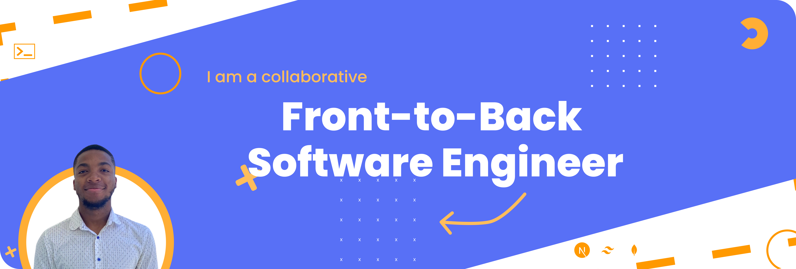

`🚀 Dive into the vibrant world of my software development journey! This portfolio is a curated showcase of my proficiency in JavaScript, React, and Python, featuring a rich gallery of diverse projects.`

## Project Link

🔗 [heritierkaumbu.dev](https://heritierkaumbu.dev)

## Features 
1. **Interactive Project Showcase** - Engage with a visual gallery of applications and websites I've crafted.
2. **In-Depth Case Studies** - Discover the stories behind select projects, from inception to completion.
3. **Universal Compatibility** - Experience seamless browsing on any device with responsive design.
4. **Insights and Reflections** - Explore my blog for personal stories and professional insights.
5. **Connect with Me** - A dedicated space for collaboration opportunities and inquiries.

## Explore and Interact  
🌐 Visit the deployed portfolio and immerse yourself in a world where technology meets creativity.

## Join the Journey
💡 Your feedback and suggestions are invaluable. Let's connect and collaborate for an even more impactful portfolio.

### Open-Source Initiative  
🌱 Embracing the spirit of collaboration and knowledge sharing in the tech community.

### Reach Out

### Heartfelt Acknowledgments 
🙌 Special thanks to the multitude of tools, libraries, and the community of peers and mentors who have supported and guided me in this endeavor.
